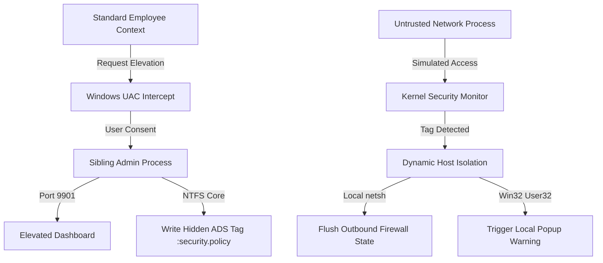

# DefendEdge Endpoint DLP Agent

An enterprise-grade, native Go-based Data Loss Prevention (DLP) security agent designed to classify sensitive local files on Windows environments using NTFS Alternate Data Streams (ADS) and enforce dynamic host isolation via the native Windows Firewall.

> **⚠️ WARNING — Active Host Containment System**
> This agent contains operational payloads that modify local Windows Defender Firewall rules and restrict outbound network traffic upon policy violation. It is strongly recommended to build, run, and test this software only inside an isolated Windows Virtual Machine (VM).

---

## 📋 System Requirements & Prerequisites

Before compiling or running the agent, ensure your test environment meets the following criteria:

- **Operating System:** Windows 10 or Windows 11
- **File System:** Main partition must be NTFS (FAT32, exFAT, and ReFS do not support Alternate Data Streams)
- **Privileges:** Administrator privileges are required to write Alternate Data Streams and modify firewall rules

---

## 🛠️ System Architecture & Workflow



---

## ✨ Features

- **Standard/Admin Console Dual-Port Design** — Automatically starts on Port 9900 (Standard Mode) or Port 9901 (Elevated Admin Mode) depending on runtime privileges.
- **Embedded Manifest Elevation** — Programmatically triggers the secure Windows UAC prompt when administrative functions are requested.
- **NTFS Alternate Data Stream (ADS) Tagging** — Writes hidden classification metadata tags (`:security.policy`) directly into the file's cluster structures without modifying the visible content hash.
- **Outbound Host Isolation Engine** — Restricts lateral movement immediately upon unauthorized file access detection by locking down active network adapters with `netsh advfirewall`.
- **SIEM / Forensic Telemetry Stream** — Collects and surfaces real-time security events in a clean web control dashboard.

---

## 📂 Repository Structure
defendedge-dlp-agent/
├── .gitignore               # Excludes built executables and temporary files
├── README.md                # Project home & documentation
├── BUILD.md                 # Technical build and cross-compile documentation
├── TEST_SCENARIOS.md        # Step-by-step validation scenarios
├── main.go                  # Core Go implementation & REST API handlers
├── app.manifest             # Application compatibility and security manifest
├── dlp_design_spec.md       # Visual & technical implementation specifications
└── docs/
├── windows_vm_guide.md  # Virtual machine testing environments guide
└── transfer_guide.md    # Local payload transfer guide

---

## 🚀 Quick Build Guide

For complete, detailed cross-compilation configurations, consult [`BUILD.md`](BUILD.md).

**Local Compile on Windows**
```bash
# 1. Generate the Windows Resource object from the manifest
rsrc -manifest app.manifest -o rsrc.syso

# 2. Compile with console hidden (Production mode)
go build -ldflags "-H=windowsgui -s -w" -o dlp-agent.exe main.go
```

**Cross-Compile from Linux**
```bash
# Generate resource object and build for target architecture
rsrc -manifest app.manifest -o rsrc.syso
GOOS=windows GOARCH=amd64 go build -ldflags "-H=windowsgui -s -w" -o dlp-agent.exe main.go
```

---

## 🧪 Validation & Testing

A comprehensive, step-by-step manual testing suite is provided in [`TEST_SCENARIOS.md`](TEST_SCENARIOS.md). You can run simulated attacks inside your Windows VM using the native Go background watcher, or through the standalone `windows_dlp_agent.html` visual simulator.

---

## ⚖️ License

This project is licensed under the MIT License — see the [LICENSE](LICENSE) file for details.
